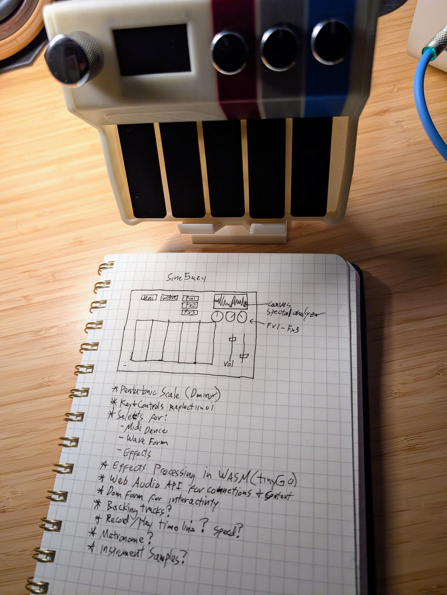

# sine5key

Adventures with a 5 key usb midi controller (rp2040), Web Audio API, Go, and Web Assembly.


## Getting Started

```bash
make build
make run
```

## Requirements

- [Go 1.25+](https://go.dev/doc/install)
- [TinynGo](https://tinygo.org/getting-started/install/)
